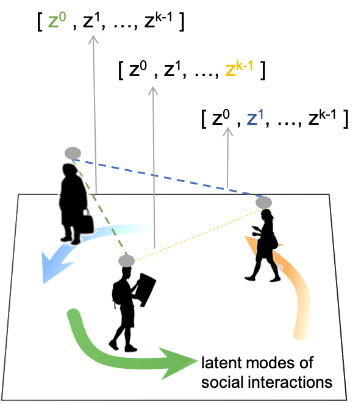

# Modeling-Interpretable-Social-Interactions-for-Pedestrian-Trajectory

Code of Paper "Modeling interpretable social interactions for pedestrian trajectory" published on Transportation Research Part C: Emerging Technologies
Volume 162, May 2024, 104617. https://doi.org/10.1016/j.trc.2024.104617

##  Overview
People interact with each other following different patterns.
These interactive patterns can be represented as interpretable variables $[z^0, z^1, ..., z^{k-1}]$ with $k$ possibilities in interaction modeling.

To incorporate social interaction in generating the next state at time $t+1$, we use the relative motion between an agent and its neighbors, represented as $(\mathcal{I}_i^t- \mathcal{I}_j^t)$, to derive a latent representation of the social interaction. For each interaction, we sample a possible mode representation $z_j^t$ from the generated mode embeddings. The representation of modalized interaction can be achieved by $(\mathcal{I}_i^t- \mathcal{I}_j^t)$ and $z_j^t$. 

## Examples and testing code

### Run ``train.sh``
- args.k_head: The number of interactive patterns among crowd considered in modeling
- Outputs: pretrained models (saved in save file), loss & valid loss for epochs (saved in save file)

### Run ``test.sh``
- args.k_head: The number of interactive patterns among crowd considered in modeling
- args.pretrained_model_index: The index of selected pretrained model for test
- Outputs: accuracy metrics (ade, fde)
  
## Dependencies
- PyTorch: https://pytorch.org/
- NumPy and SciPy: http://www.numpy.org/

